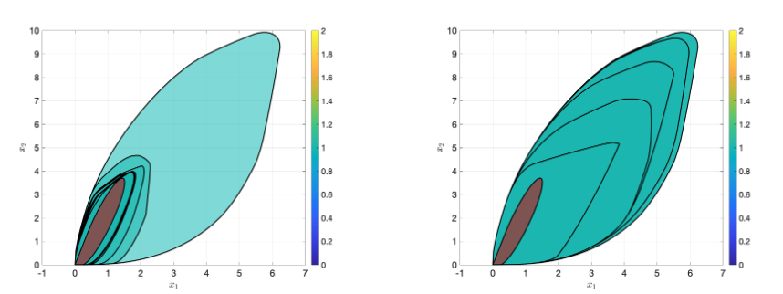
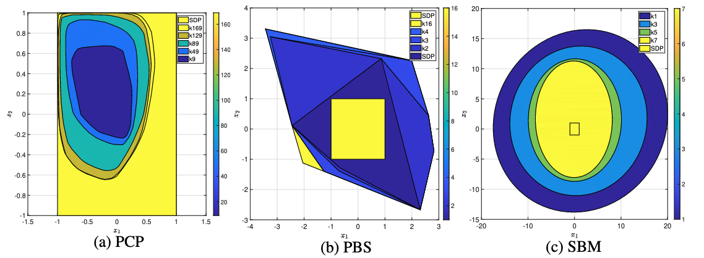
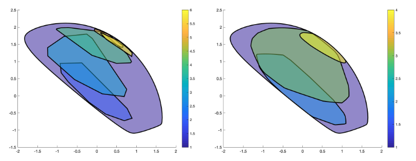

# Iterative Approximating Techniques for SDPs by Cutting-planes

This is the codes for UCSD Winter22 ECE285 final project. We implement basically 5 algorithms in 3 papers namely A spectral bundle method for semidefinite programming, Sum of squares basis pursuit with linear and second order cone programming and On polyhedral and second-order cone decompositions of semidefinite optimization problems. 

Experiments are conducted by benchmark dataset [SDPLIB](http://euler.nmt.edu/~brian/sdplib/).

Main file to run SOCP Numerical Experiment

```
main_socp_decomp.m
```



Main file to run Spectral Bundle Algorithm

```
main.m
```



Main file to run DSOS Algorithm

```
SOCPs.m
LPs.m
```

